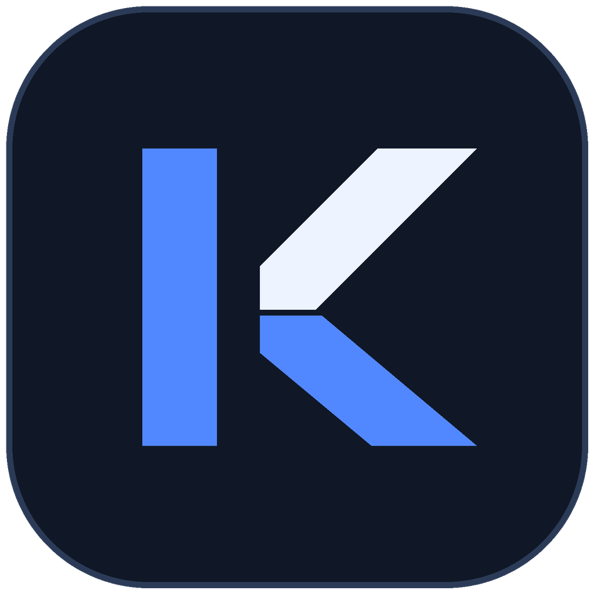

# Stock King



[简体中文](README.md) | English

A local desktop for stock quantitative research and China A-share research: quotes, charts, watchlists, scheduled picks, account backtests, observation review and manual AI research. Supports Windows x64 and Apple Silicon (M series, macOS 15+).

- Free Tencent/Sina quote fallback with original timestamps and freshness checks.
- Weekday picks at 09:20, 10:30 and 14:55; review at 15:30; Friday learning at 15:45, Asia/Shanghai time.
- Automatic tasks use local models. AI review is manually triggered; no automatic AI API spending.
- User data, models and settings are stored locally. No automatic trading.
- Core workflows need no paid API, cloud server or GitHub Actions. Build and validate on your own computer; AI can use local Ollama or manually imported reports.

AI tools can reuse the same quotes through the [read-only MCP quote service](quote-service/README.md). Python execution is supported on Windows and macOS; the ChatGPT cloud connection still requires remote authorization and end-to-end testing.

## Quick start

1. Obtain a native wheel or macOS `.app` archive supplied by the maintainer. If you have source access, follow [local building and distribution](docs/LOCAL_BUILD.en.md) to build on your own Windows or Apple Silicon computer. The repository is currently in private testing, so cloning requires permission.
2. Python 3.11+ is supported (3.12 recommended); use a native 64-bit Python matching your platform. From the directory containing the wheel, run the following command (substitute the actual filename if its version differs):

   ```text
   python -m pip install ./stock_king-2.6.0-py3-none-win_amd64.whl
   stock-king
   ```

   Apple Silicon uses `stock_king-2.6.0-py3-none-macosx_15_0_arm64.whl` and requires ARM64 Python. Windows requires WebView2 Runtime. On Mac, you can instead extract the `.app` archive, copy `Stock King.app` to `/Applications`, open it, and confirm the interface says “已连接” (Connected).
3. Add research symbols in “自选”, then select “刷新全部” in “精选 → 当日机会”. Check evidence timestamps, missing data and entry conditions first.
4. Configure a model when you need AI; quotes and local rules do not require an AI API key. Select a training universe or prepare backtest data before using “策略”.

The project is not published on PyPI and has no public installer download page yet. `pip install stock-king` is not the current installation method for this repository. Users with repository access can start with the research CLI:

```text
python -m pip install "stock-king[data] @ git+https://github.com/yunpengchen10/StockKing.git@main"
stock-king doctor
```

Source installation provides the research CLI; use a platform-native wheel or the macOS `.app` archive for the complete desktop. The display name is **Stock King**, and the GitHub repository is **StockKing**. The command remains `stock-king` for compatibility with existing installations. See [local building and distribution](docs/LOCAL_BUILD.en.md).

## Pages and workflow

The interface is primarily Chinese. Chinese menu labels are retained below so that you can find the corresponding controls.

| Page | Purpose and actions |
| --- | --- |
| 市场 — Market | Review the market overview, trading session and research leads before choosing symbols to investigate. |
| 自选 — Watchlist | Search symbols and organize groups; open individual charts or AI research. Watchlist records are not actual brokerage positions. |
| 图表 — Charts | Inspect candles, technical indicators and price/volume structure; verify the current price, trend and trading plan. |
| 精选 → 当日机会 — Daily opportunities | Refresh scans and switch between conservative, balanced and aggressive entry profiles. Read selection reasons, evidence, trigger/invalidation/no-chase conditions; history and recommendation records preserve the original snapshots. |
| 精选 → 策略分组 — Strategy groups | Inspect existing strategy groups and model status, separately from the three entry filters in daily opportunities. |
| AI 研究 — AI research | Select a symbol and template, retrieve evidence, then manually call a configured model. You can also export research packages, import external AI reports and compare consensus, disagreements and evidence times. |
| 策略 — Strategies | In account backtesting, import market data and signals recorded before execution, configure costs and fill constraints, and inspect equity and trade records. Train and check model eligibility within the selected universe. |
| 多图 — Multiple charts | Compare several symbols in one workspace. |
| 工具 — Tools | Access AI platform configuration, reports and deep research, fund research, research assistant, scheduled tasks, and data tools. |
| 设置 — Settings | Manage preferences, quote refresh, notifications and AI analysis settings. Save after making changes. |

Suggested sequence: **Market → Watchlist → Daily opportunities → Chart verification → Optional AI review → Historical review**. Empty candidate lists, pending verification and expired evidence are valid states. Unknown evidence must not be treated as passed, and observed price changes are not realized trading returns.

## AI configuration

**Free starting point:** Core features work without AI configuration. For local AI, use the configuration steps below with Ollama: Base URL `http://localhost:11434/v1`, local placeholder key `ollama`, and the exact installed model tag. You can also export research packages and manually import existing reports in “AI 研究”. Local models need suitable memory and compute; users choose any external service used to create imported reports.

1. Open “工具 → AI 平台配置” and click “添加AI配置”. The legacy path is “设置 → AI设置”, enable “AI诊股”, then “前往管理”; that switch does not replace model configuration.
2. Enter **configuration name, Base URL, API key and Model ID**. The endpoint must support the OpenAI-compatible Chat Completions format used by the application. Use model IDs actually available from your provider.
3. Click “测试并刷新模型列表”. This checks the model-list endpoint; it does not verify answer generation or reasoning parameters.
4. Click “确定” in the drawer, then **“保存配置”** on the list page. Wait for the save confirmation before leaving.
5. Return to “AI 研究” or “精选 → 当日机会”, select the platform and model, and manually start research or “AI 复审”. Provider charges may apply.

| Field | How to configure it |
| --- | --- |
| Base URL | Use the API base, retaining required prefixes such as `/v1`. Do not use a chat website or append `/chat/completions`. |
| API Key | Use a key from the corresponding API platform. A website login or chat subscription does not configure API access here. Enter it only in your local configuration page. |
| Model ID | Select from the list or enter the exact ID; a display nickname is not sufficient. |
| Temperature / MaxTokens | Set sampling and maximum output according to the model's capabilities; follow provider guidance for unsupported parameters. |
| Timeout / 深度思考 | Timeout is measured in seconds. Reasoning models may need longer. Enable deep thinking only when both the model and endpoint support it. |
| HTTP proxy | Configure for your network if needed. The model-list test uses the general HTTP client, so it does not verify the proxy assigned to an individual configuration. |

See the [AI configuration manual](docs/AI_CONFIGURATION.en.md) for examples, local Ollama, report imports, key handling and troubleshooting. Saved settings are local, but manual use of a remote AI sends selected evidence, prompts and request content to that provider. Routine scheduled scans do not call AI automatically; separately enabled bots or other AI tasks must be managed individually.

## FAQ and local validation

| Symptom | What to do |
| --- | --- |
| An old commit still shows failed checks | Historical jobs were blocked by GitHub billing restrictions. Actions is now disabled; no paid allowance is needed. Historical failures do not become passing results. |
| No installer is available, or a package has expired | Use a maintainer-supplied local build or build again using the local instructions. Installation does not depend on temporary Actions artifacts. |
| Engine not ready, missing quotes or an empty candidate list | Check network and engine status, quote timestamps and evidence gaps. Insufficient evidence can legitimately produce no candidates. |
| Connection test passes but AI still fails | Listing models and generating answers use different endpoints. Check model permissions, balance, exact model ID, reasoning parameters and the actual request error. |
| pip says the wheel is unsupported | Check Windows x64 / macOS ARM64, Python architecture and the macOS 15+ requirement. Intel Macs are not supported. |

This repository does not use GitHub Actions or require GitHub Pro or paid build services. Local scripts run the corresponding tests and installation checks. Validate Windows and Apple Silicon on their respective machines. See [local building and distribution](docs/LOCAL_BUILD.en.md) and the [historical build troubleshooting note](docs/CI_TROUBLESHOOTING.en.md).

## Recommendation algorithms

Version 2.6 adds conservative, balanced and aggressive entry checks in “当日机会”, plus AKShare archives for financial statements, earnings forecasts and share unlocks. Missing data does not imply no risk; inadequate room below resistance blocks selection. Initial thresholds have not been validated for out-of-sample returns. See the [algorithm comparison, thresholds and validation plan (Chinese)](docs/precision-and-packaging.md).

Daily picks follow full-market leads → minute price/volume and historical structure verification → three entry profiles → conditional observation. Each profile contains at most five symbols, with no quota filling. Evidence rules use `king-evidence-20260920`; entry checks use `king-precision-v1`. These are local evidence rules without return calibration.

| Stage | Implementation |
| --- | --- |
| Universe and screening | Main-board, non-ST symbols. Separate ranks for traded amount, volume ratio, turnover and recovery from the open prioritize at most 30 symbols for deeper research. The former 40%-price-change weighted score is removed. There is no fixed price-change interval; unexamined symbols are not described as excluded. |
| Selection evidence | Intraday 3/5-minute recovery with VWAP support or a local breakout; premarket output is observation only. Evidence completeness and cumulative traded amount organize observations. Price bias, ATR distance, reward/risk space and financial events are checked by profile; uncalibrated win rates are not displayed. |
| Indicators and reasons | Each record preserves actual selection reasons, risks, trigger/invalidation/no-chase conditions, indicator values, units, uses, source timestamps and decision definitions. Indicators include 1/3/5-minute price changes, VWAP, 3-minute traded amount, moving averages, ATR, volatility, drawdown and historical resistance. Missing data is not fabricated. |
| Evidence gaps | Minute history is cached by day, with attempts to build a 20-day same-time baseline. Insufficient historical, sector-minute or flow coverage blocks selection. Historically knowable financial/event data cannot be backfilled before the first archive. Catalysts and expectation gaps still require original news evidence. |
| Quote and risk checks | Tencent/Sina fallback, security identifiers, original timestamps, prices and freshness. Incomplete auction evidence remains conditional; unbuyable limit-up names are tracked separately. |
| Review and learning | Persisted source timestamps and observed price changes; unknown evidence stays unknown. Repeated gaps become review reminders. Friday retraining stays within the user's initialized stock universe. |
| Manual AI review | Evidence, risk and disagreement summaries without changing the local ranking; invoked only by the user. |

## Quantitative algorithms

| Module | Algorithms and purpose |
| --- | --- |
| Price/volume features | Alpha158-style momentum, returns, volatility, price/volume relationships and candlestick features using information available through each timestamp. |
| BalancedRank | LightGBM LambdaRank, DoubleEnsemble-inspired hard-sample reweighting and a Ridge baseline for 5/20-day cross-sectional ranking, with exposure neutralization and out-of-sample nonnegative ensemble weights. Daily picks use the qualified five-day branch. |
| SafeBound | LightGBM quantile regression for 20/60-day lower return bounds, out-of-sample quantile corrections, volatility and drawdown estimates, compared with rolling-volatility/HAR-style baselines. |
| LimitPulse | LightGBM and logistic-regression discrete-time first-limit-touch hazards over 1–3 days, per-day sigmoid calibration and cumulative event probability `1 − ∏(1 − hᵢ)`. Touching a limit does not imply a fill or profit. |
| MASTER challenger | A local reimplementation inspired by the Market-Guided Stock Transformer: market-guided feature gates, temporal attention and cross-stock attention; independently qualified local checkpoints only. |
| Model assessment | Purged walk-forward evaluation, separate calibration/holdout periods, RankIC, NDCG, cost-adjusted research labels and time-block bootstrap; qualified champion retention. |
| Account backtesting | Event-driven simulation of point-in-time signals, trading calendars, execution restrictions, slippage and fees, including a one-session-delay comparison. Separate from model-label evaluation. |

SafeBound, BalancedRank and LimitPulse are project module names. Ranking percentiles are not win probabilities. Research labels, paper results and observed price changes are not live trading returns. Models require training on the selected universe; upstream pretrained weights are not distributed.

## Windows

Python 3.11+ can install the research tools through pip; 3.12 is recommended. Desktop wheels are built locally. The repository is currently private and not published on PyPI. See [local building and distribution](docs/LOCAL_BUILD.en.md) for installation and platform differences.

Development requires Python, Node.js 20+, Go 1.26 (as required by `desktop/go.mod`) and Wails 2.11. Go 1.27.1 failed during this project's Wails 2.11 binding build; the packaging scripts select Go 1.26.8.

```powershell
python -m venv .venv
.\.venv\Scripts\python.exe -m pip install -r daily-engine/requirements.txt
go install github.com/wailsapp/wails/v2/cmd/wails@v2.11.0
cd desktop
wails dev
```

Build a native desktop wheel (no NSIS, Actions or paid certificate required):

```powershell
powershell -ExecutionPolicy Bypass -File scripts/build-windows-wheel.ps1
```

## macOS (Apple Silicon)

Supports Apple Silicon (M series) and macOS 15+; no Intel Mac build is provided. For a source build, first install an official macOS universal2 Python 3.11 or 3.12 (3.12 recommended) from [python.org](https://www.python.org/downloads/macos/). Use its native ARM64 interpreter. Also install Node.js 20+, Go 1.26, Xcode Command Line Tools and `libomp`; if `brew` is missing, follow the [official Homebrew installer](https://brew.sh/) first. Check the command line tools with `xcode-select -p`; if missing, run `xcode-select --install` and wait for installation to finish. Go 1.27.1 failed during this project's Wails 2.11 binding build. The build script checks the Python interpreter and project virtual environment before the expensive build stages.

Build from source:

```bash
xcode-select -p
brew install node go@1.26 libomp
export PATH="$(brew --prefix go@1.26)/bin:$PATH"
go version  # must report go1.26.x
export PYTHON_BIN=/Library/Frameworks/Python.framework/Versions/3.12/bin/python3.12
"$PYTHON_BIN" -c 'import platform, pyexpat; assert platform.machine() == "arm64"'
git clone https://github.com/yunpengchen10/StockKing.git
cd StockKing
bash scripts/build-macos.sh
```

If you installed Python 3.11, change `PYTHON_BIN` to `/Library/Frameworks/Python.framework/Versions/3.11/bin/python3.11`. The script uses Go 1.26.8, installs Wails 2.11 if needed, and recreates an incompatible project `.venv` before the build. Standard `HTTP_PROXY`, `HTTPS_PROXY`, `ALL_PROXY` and `NO_PROXY` settings are inherited by build commands when your network needs a proxy. Dependency downloads and the full test, desktop, engine and wheel builds can take considerable time on a first run.

The outputs are `artifacts/macos/Stock-King-macos-arm64.zip` and a wheel in `dist/desktop/`. Extract the archive, move `Stock King.app` to `/Applications`, open it, and confirm “已连接” (Connected) in the interface. The build is ad-hoc signed and requires no purchased developer certificate; it is not Apple-notarized, so first launch may need approval in System Settings → Privacy & Security. The script stages the signed application outside cloud-synced folders to avoid extended attributes invalidating the signature.

From the source checkout, enable independent background research, including when the desktop window is closed:

```bash
python3 scripts/install-macos-schedule.py
# Remove later: python3 scripts/install-macos-schedule.py --remove
```

This is a separate, optional step after installing the `.app`; the desktop build does not install background jobs. Stay logged in with the computer awake. On weekdays, the jobs start preparation at 09:10, 10:20 and 14:45, then refresh at 09:20, 10:30 and 14:55; review runs at 15:30, and Friday learning at 15:45. All times are Asia/Shanghai regardless of the Mac timezone. Missed intraday slots are not backfilled. The native `macosx_15_0_arm64` wheel includes LightGBM and PyTorch for MASTER.

## Acknowledgements

Thank you to these authors, teams and all contributors. Stock King integrates or adapts their work and retains applicable copyright and license notices.

| Authors / team | Project and contribution |
| --- | --- |
| [ArvinLovegood](https://github.com/ArvinLovegood) and contributors | [go-stock](https://github.com/ArvinLovegood/go-stock): Go/Wails/Vue desktop foundation (GPL-3.0). |
| [ZhuLinsen](https://github.com/ZhuLinsen) and contributors | [Daily Stock Analysis](https://github.com/ZhuLinsen/daily_stock_analysis): research engine (MIT); [AlphaSift](https://github.com/ZhuLinsen/alphasift): screening code and strategy material (Apache-2.0). |
| Tong Li, Zhaoyang Liu, Yanyan Shen, Xue Wang, Haokun Chen, Sen Huang / SJTU-DMTai | [MASTER](https://github.com/SJTU-DMTai/MASTER), AAAI 2024: market-guided attention architecture reference (MIT). |
| Microsoft Qlib team and contributors | [Qlib](https://github.com/microsoft/qlib): Alpha158-style features, DoubleEnsemble ideas and quantitative research references; the local implementation is not a claim of full reproduction. |
| LightGBM, PyTorch and scikit-learn authors and maintainers | [LightGBM](https://github.com/lightgbm-org/LightGBM), [PyTorch](https://github.com/pytorch/pytorch), [scikit-learn](https://github.com/scikit-learn/scikit-learn): training, ranking, neural networks and statistical modelling. |
| AKShare, Wails, Vue, Naive UI and dependency maintainers | [AKShare](https://github.com/akfamily/akshare) and the data, desktop and interface ecosystems. |

See [third-party notices](THIRD_PARTY_NOTICES.md) and [licenses/](licenses/) for license details.

## Development and license

`desktop/` contains the Wails/Vue app; `daily-engine/` contains the Python engine. Run relevant Python tests, frontend `npm test`, and desktop `go test .` after changes.

See [research workflow](docs/RESEARCH_WORKFLOW.md), [backtest methodology](docs/EXECUTABLE_BACKTEST.md), and [integration](INTEGRATION.md).

See [LICENSE](LICENSE) and [THIRD_PARTY_NOTICES.md](THIRD_PARTY_NOTICES.md) for project and upstream licenses. For research only; no investment advice or promised returns.
