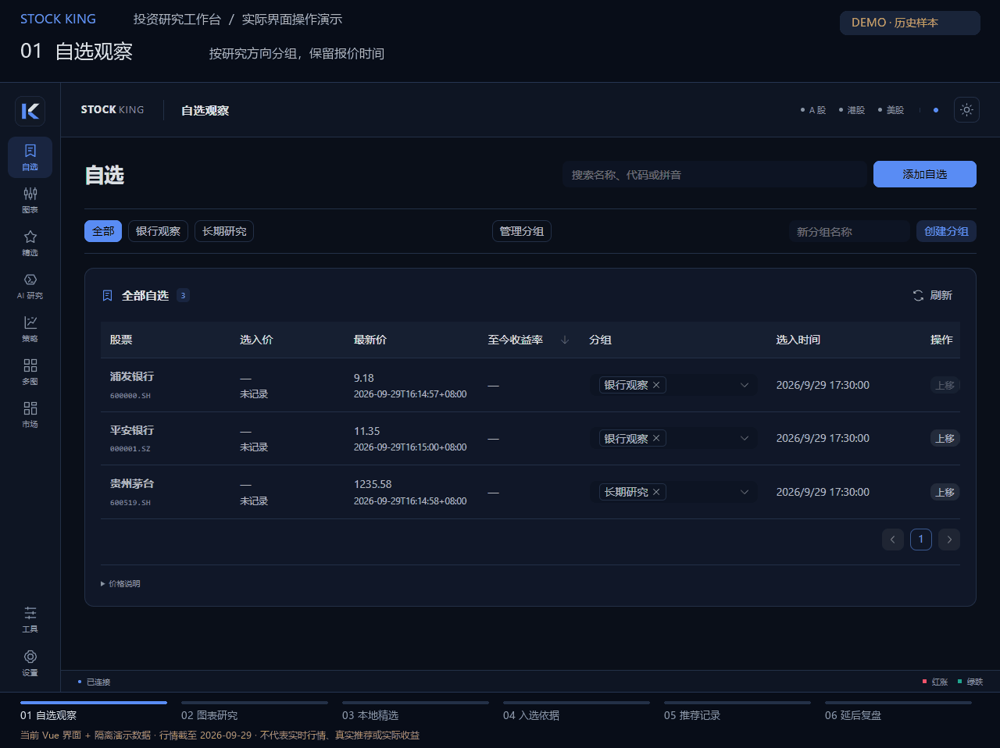

# README 工作台操作动图 / Workspace tour



这张 GIF 由当前 Vue 前端的生产构建在 Chromium 浏览器中实际渲染，Playwright 点击界面后截图，再用 Pillow 编码。六个场景依次展示自选分组、K 线与指标、本地精选、入选依据、推荐记录和延后复盘。字幕与点击指针位于演示合成层，产品界面的布局和控件未经重画或替换。

This GIF shows the current production Vue UI, rendered in Chromium and operated with real Playwright clicks. Its six scenes cover watchlist groups, chart indicators, local picks, selection evidence, saved signals, and delayed reviews. Captions and the click pointer are presentation overlays; the product UI is captured as rendered.

## 数据与隔离边界 / Data and isolation

- 浏览器使用全新临时 context；Wails bridge 只返回 [演示 fixture](../scripts/workspace-tour-fixture.cjs)，不读取用户数据库、自选、持仓、AI 配置或凭据。
- K 线与报价取自仓库中的 [2026-09-29 历史行情样本](research/stockking-v11-market-sample.json)，沿用原始来源和未复权口径，不联网刷新。选入价格留空，避免把虚构选入时点生成的变化当成业绩。
- 候选、排序、分组、推荐记录和复盘条目均为演示 fixture。排序分、概率、模型表现与模拟收益不伪造；复盘显示待复盘与证据不足。
- 三只样本仅用于界面展示，未运行全市场筛选。软件真实扫描按沪深主板池的 10% 向上取整，至少 300 只且不超过池大小；动画里的三只样本不代表扫描覆盖结果。
- 脚本只启动绑定到 `127.0.0.1` 临时端口的静态文件服务器；浏览器拒绝其他来源的请求。不启动 Go / Python 后端，不执行扫描、训练、交易或 AI 服务调用。
- 每一帧都标注演示数据与历史日期。动图不代表实时行情、真实推荐或实际收益。

The browser runs in a fresh context with an in-memory Wails fixture. Historical OHLC/quotes are loaded from the repository sample; no user database, portfolio, credentials, live market, AI service, scan, or backend is accessed. Candidates and ledger entries are illustrative; uncertain metrics and returns stay empty. The three fixture instruments are not evidence of production scan coverage. Every frame discloses the demo and historical-data scope.

## 复现 / Reproduce

需要 Node.js、已安装的前端依赖、Playwright、Chromium 或 Microsoft Edge、Python 和 Pillow，以及支持中文的字体。

Install the frontend dependencies, Playwright, Python/Pillow, and a Chinese font. The default browser channel is Microsoft Edge. Use `TOUR_BROWSER_CHANNEL=chromium` for a Playwright-managed Chromium installation.

```powershell
npm --prefix desktop/frontend ci
python -m pip install Pillow
# Install Playwright in a separate tools folder; do not alter the app package.
npm install --prefix artifacts/tour-tools playwright
$env:PLAYWRIGHT_MODULE = (Resolve-Path artifacts/tour-tools/node_modules/playwright).Path
$env:TOUR_PYTHON = (Get-Command python).Source
node scripts/capture-workspace-tour.cjs
```

If Microsoft Edge is unavailable:

```powershell
node artifacts/tour-tools/node_modules/playwright/cli.js install chromium
$env:TOUR_BROWSER_CHANNEL = 'chromium'
node scripts/capture-workspace-tour.cjs
```

可选环境变量 / Optional environment variables:

| 变量 | 用途 |
| --- | --- |
| `PLAYWRIGHT_MODULE` | Playwright 包路径；否则尝试普通 Node 模块与 Codex bundled runtime |
| `TOUR_BROWSER_CHANNEL` | 默认 `msedge`；`chromium` 使用 Playwright 自带浏览器 |
| `TOUR_PYTHON` | Python 可执行文件；否则尝试 Codex bundled Python，再尝试 `python` |
| `TOUR_FONT` | 中文字体路径；默认尝试 Windows 微软雅黑与 Linux Noto Sans CJK |

脚本默认重新构建当前前端到 `artifacts/workspace-tour/build`，不覆盖安装目录或产品发布产物。仅调试同一构建的演示场景时可加 `--skip-build`。源代码变化后应移除此参数重建。

The script builds the current frontend into the ignored `artifacts/workspace-tour/build` directory. It does not overwrite an installed application. `--skip-build` may be used only when iterating on a tour using an already-current build.

## 产物与验收 / Outputs and checks

- [GIF](media/stockking-workspace-tour.gif)：README 自动循环动图。
- [PNG 封面](media/stockking-workspace-tour.png)：静态预览及无法播放 GIF 时的替代图。
- [来源与运行记录](media/stockking-workspace-tour.provenance.json)：数据日期、调用的方法、帧数、时长、体积和隔离验证。
- `artifacts/workspace-tour/`：原始截图、帧清单和构建日志；不会提交到 Git。

运行结束前，脚本检查真实图表 canvas、三个复盘期限、浏览器错误、外部请求和扫描调用，并完整解码所有 GIF 帧，验证尺寸、循环、多帧、总时长以及文件不超过 5 MiB。首次发布或界面改变后，还需逐场景检查文字清晰度、遮挡、图表数据和切换连贯性。

Before succeeding, the script checks chart canvases, all three review horizons, browser errors, external requests and scan initiation. It decodes every GIF frame and verifies dimensions, duration, animation, looping, and the 5 MiB size limit. Visual review of all six scenes remains necessary after UI changes.
